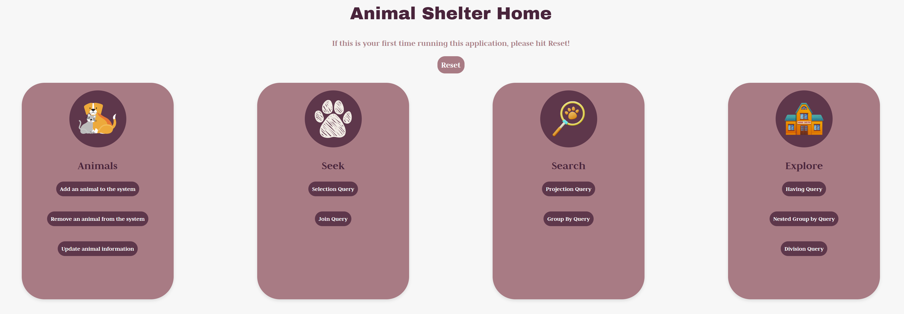
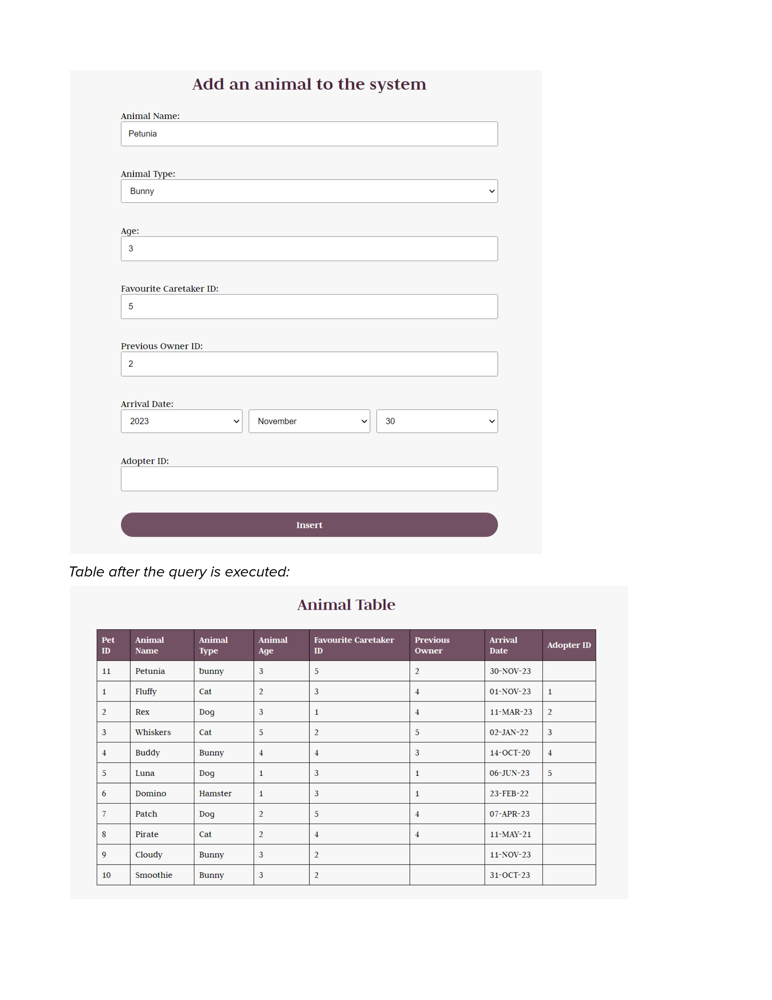
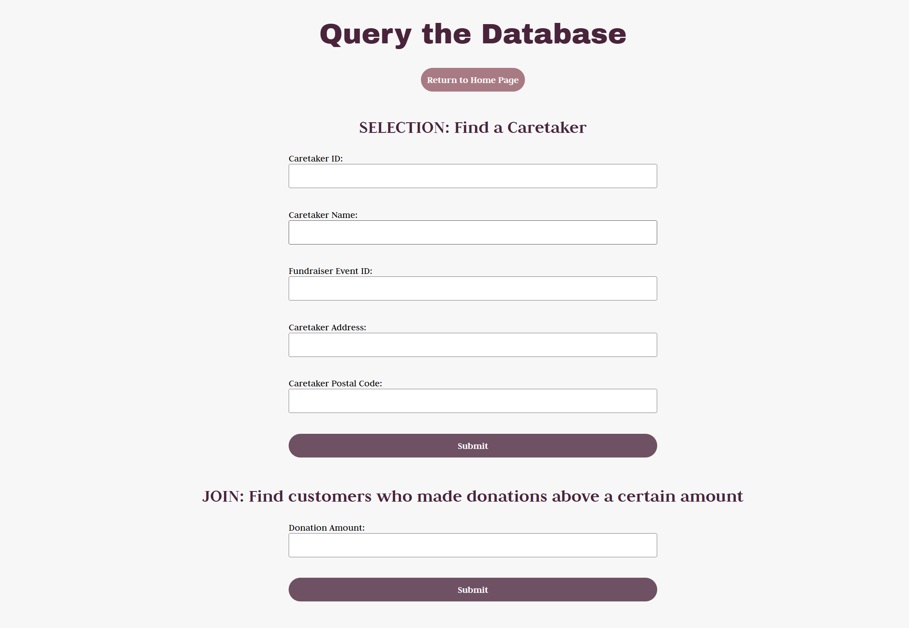
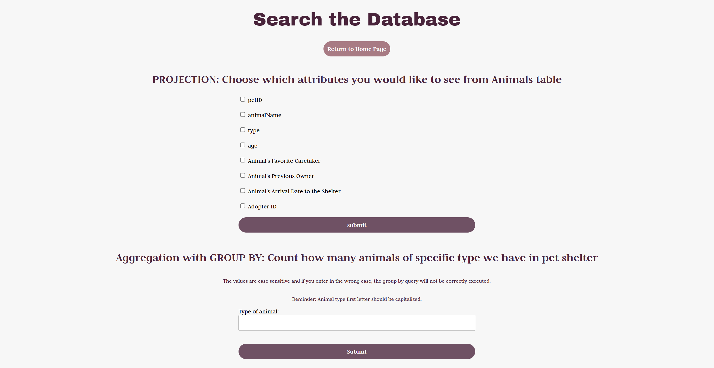

# Pet Shelter Management System

## Project Overview
The Pet Shelter Management System is a web-based application designed to streamline the management of pet shelters, including adoption tracking, appointments, staff coordination, and inventory management. This system provides an efficient way to manage relationships between animals, adopters, employees, and volunteers, ensuring a smooth adoption experience.

## Features
**Animal Management:** Add, update, and remove animals in the shelter.

**Adoption Process:** Track adopters and manage adoption records.

**Appointments:** Schedule and manage vet and adoption appointments.

**Staff & Volunteer Management:** Organize caretakers, workers, and volunteers.

**Database Queries:**
  - Search for caretakers by name, ID, or address.
  - Identify donors contributing above a certain threshold.
  - Retrieve the count of animals by type in the shelter.

**Data Integrity:** Uses SQL constraints like `ON DELETE CASCADE` to maintain database consistency.

## Tech Stack
**Frontend:** HTML, CSS, JavaScript
**Backend:** PHP
**Database:** Oracle SQL
**Version Control:** Git

## Database Schema
The database includes the following tables:
- Animal
- Adopter
- Appointment
- VetAppointment
- Worker
- Volunteer
- FundraiserEvent
- Donation
- ItemPurchase
- See `Report.pdf` for more table details

## SQL Query Highlights
Our application includes several database operations:

**INSERT:** Users can add new animals, staff, and adopters.

**DELETE:** Removing an animal or adopter automatically cascades related records.

**UPDATE:** Modify animal details, adoption records, and caretaker assignments.

**SELECT & JOIN:** Retrieve and display key relationships between animals, adopters, and staff.

**Aggregation & Division:** Find donation statistics, volunteer participation, and customer spending trends.

## Screenshots
### 
### 
### 
### 

## Team Members
- Madeline Paulson
- Tara Ubovic
- Robin Matheson